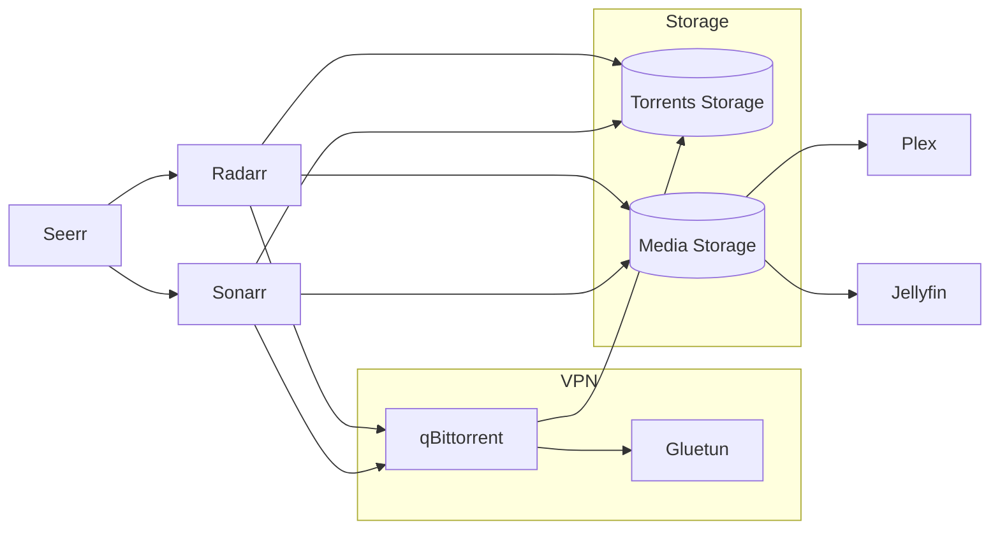

# Arr Stack

In this readme, I explain how I set up my arr stack. This is how I am currently doing it, which can be improved.

## Services

Following diagram shows an overview of the most important services and how they work together



* **plex**: for streaming the media
* **jellyfin**: for streaming the media
* **gluetun**: VPN tunnel for qBittorrent
* **qbittorrent**: (Port 8080 through gluetun) downloads torrents through the VPN tunnel
* **sonarr**: (Port 8989) manages and automatically downloads TV shows
* **radarr**: (Port 7878) manages and automatically downloads movies
* **prowlarr**: (Port 9696) manages indexers and shares them with the *arr applications
* **bazarr**: (Port 6767) automatically downloads and manages subtitles
* **seerr**: (Port 5055) allows users to request movies and TV shows
* **flaresolverr**: (8191) bypasses Cloudflare protection for supported indexers
* **recyclarr**: syncs TRaSH Guides quality profiles and custom formats with Sonarr and Radarr

Each service can reach another service with `http://<name-of-service>:<port>`. The plex and jellyfin services are running on the host, and those can be called from the IP instead with the name of the service. You can find the port numbers in the docker compose file.

## Installation

### Data

Create the following folder structure:

```shell
mkdir -p hdd01/{data/{media/{movies,music,tv},torrents/{movies,music,tv}},movies,tv}
chown -R 1000:1000 hdd01
```

```txt
hdd01
├── data
│   ├── media
│   │   ├── movies
│   │   ├── music
│   │   └── tv
│   └── torrents
│       ├── movies
│       ├── music
│       └── tv
├── movies
└── tv
```

In the `data` directory is where arr stuff is happening. The separate `movies` and `tv` directories are where I put the `media` files for read-only access and so that the arr stack cannot suddenly mess the data up.

## Config

Create the following folder for storing the config of the containers of the arr stack:

```shell
mkdir -p /home/joel/config/{plex/{config,transcode},qbittorrent,sonarr,radarr,prowlarr,bazarr,seerr,jellyfin,recyclarr}
sudo chown -R 1000:1000 /home/joel/config
```

### Run

Set the following environment variables and run the `compose.yml` file.

```shell
CONFIG=/home/joel/config
VPN_USER=<vpn-username>
VPN_PASS=<vpn-password>
DATA_DIR=/mnt/hdd01
```

### Configure

I use the [Arr-Stack from automation-avenue](https://github.com/automation-avenue/arr-new) and changed it a little bit for my needs. I simply followed what is in this tutorial.

I have set up my homelab in a [Tailscale](https://tailscale.com) network that I can access from outside my home network. Each service can be reached under `http://<ip-from-homelab>:<port-number>`.
